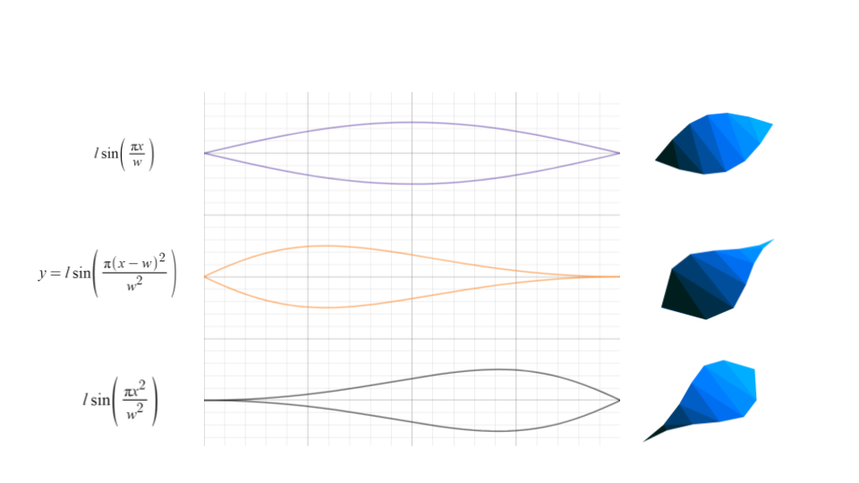
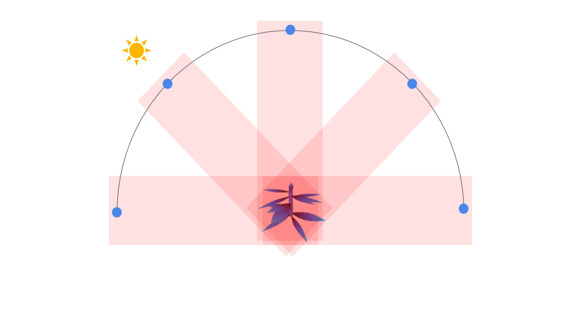
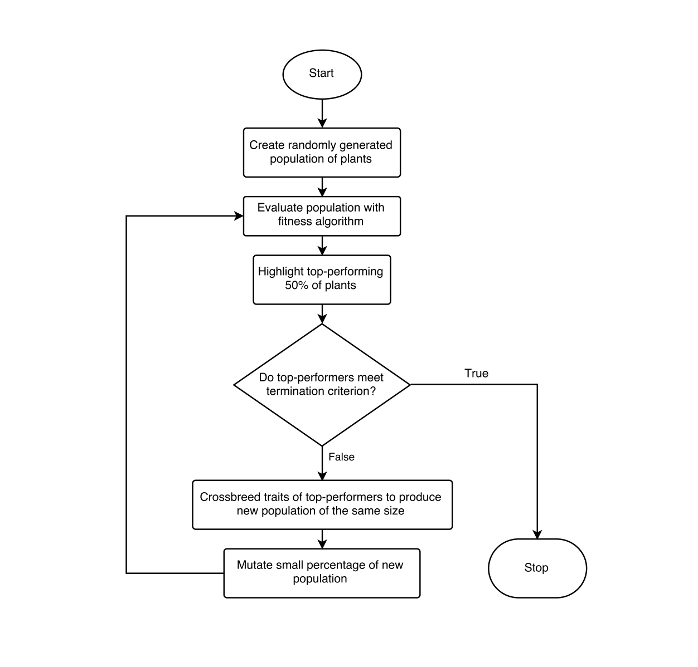

# Generating optimum-efficiency digital solar arrays using genetic algorithms, inspired by plant phyllotaxy. 

This program defines a few basic characteristics of digital "plants" which are controlled using a genetic algorithm. Fitness of individual plants are evaluated by a unique parallel ray-casting algorithm that represents sun exposed area over time. Won 4th Place in Bioinformatics/Computational Biology at Intel ISEF 2018.

There are three possible leaf functions, whose basic shape are described by the below functions:

The following diagram shows how the fitness algorithm simulates the sun's rays crossing the sky: 

The fitness is the average number of ray hits across all possible "above-ground" angles.

The following flowchart shows the genetic algorithm/process of plant selection:

